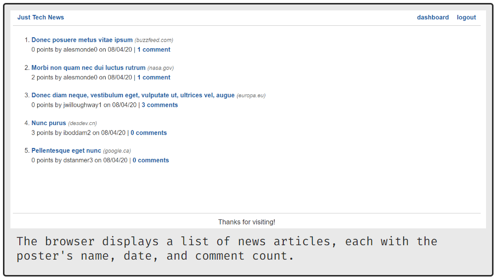
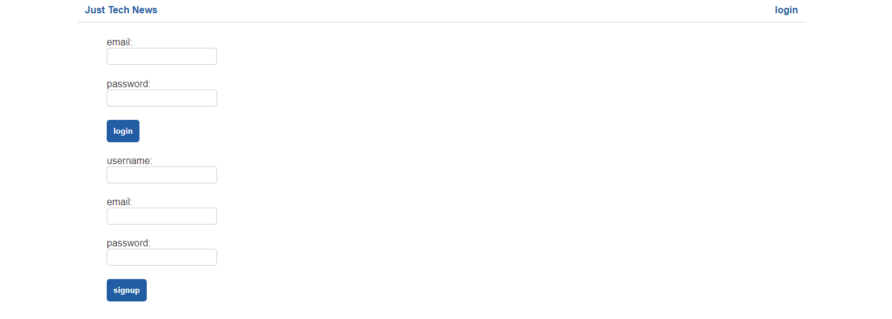

# Just-Tech-News w/ Python-backend

In this project, we'll use Python as the basis for a web server. Instead of building it from scratch, we'll refactor the back end of an app that was originally built using Node.js. The app, called Just Tech News, lets users submit links to tech-related articles, comment on other users

## Contributor
Erik P. Williams